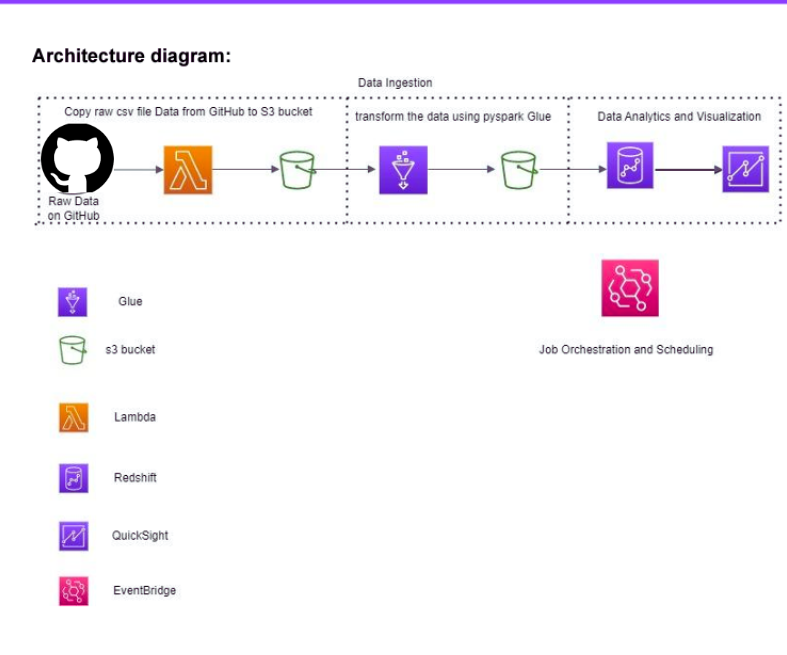
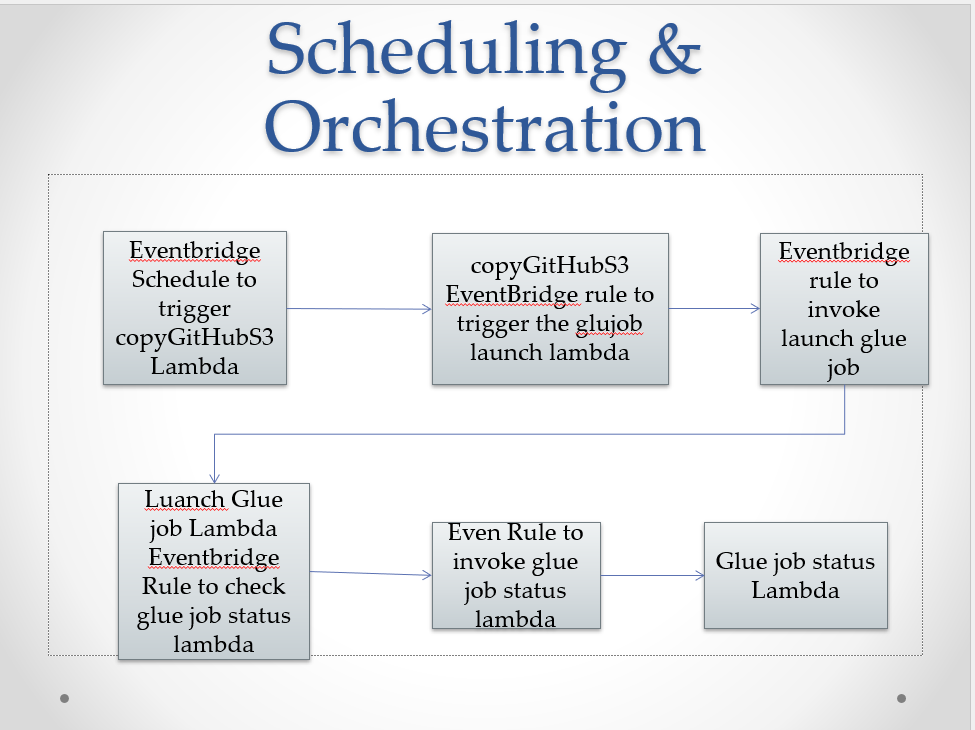

# COVID-19-Data-Analysis-Project-using-Python-and-AWS-Stack

## Project Aim

The main goal of this project is to build a comprehensive data pipeline using various AWS tools to conduct advanced COVID-19 data analysis. The solution helps public health officials, researchers, and the general public understand the virus's trends and patterns. It facilitates more informed decision-making regarding the virus’s spread, response measures, and resource allocation.
## Tech Stack

- **Programming Language**: Python
- **Data Processing Package**: PySpark

### AWS Services:
- **AWS Lambda**
- **AWS Glue**
- **AWS S3**
- **Amazon Redshift**
- **Amazon EventBridge**
- **Amazon QuickSight**

## Data Source
The data used in this project is sourced from the [Johns Hopkins University GitHub Repository](https://github.com/CSSEGISandData/COVID-19), which provides up-to-date global information on COVID-19 cases, deaths, and recoveries. This data is updated daily and available in CSV format, with information on confirmed cases, deaths, and recoveries by region and date.

## Data Architecture

The architecture for the COVID-19 data analysis pipeline is as follows:

### AWS Services Used:

- **AWS Lambda**: Handles event-driven actions for copying data and triggering jobs.
- **AWS S3**: Serves as the data lake for storing raw and transformed data.
- **AWS Glue**: Automates the ETL process, transforming raw data using PySpark.
- **Amazon Redshift**: Provides a scalable data warehouse solution for storing and querying large datasets.
- **Amazon QuickSight**: Delivers interactive visualizations and dashboards for data analysis.
- **Amazon EventBridge**: Manages job scheduling and orchestration to automate the entire pipeline.

## Scheduling and Orchestration

This section outlines the scheduling and orchestration workflow using AWS EventBridge, Lambda, and Glue. The diagram below illustrates the step-by-step process:

### Workflow Explanation:

#### 1. EventBridge Schedule:
An AWS EventBridge rule is set to trigger the `copyGitHubS3` Lambda function at a scheduled time. This Lambda function is responsible for copying data from the Johns Hopkins University GitHub repository to an S3 bucket.

#### 2. copyGitHubS3 Lambda:
Once triggered, this Lambda function copies the data to S3. An EventBridge rule monitors this process and, upon completion, triggers another rule to launch the Glue job.

#### 3. EventBridge Rule to Trigger Glue Job:
This EventBridge rule invokes the Lambda function that launches the Glue job. This Glue job is responsible for the ETL (Extract, Transform, Load) process, converting the raw COVID-19 data into a format suitable for analysis in Amazon Redshift.

#### 4. Glue Job Launch Lambda:
The Glue job is initiated by a Lambda function which handles the job configuration and execution. Another EventBridge rule is used to check the status of the Glue job.

#### 5. Glue Job Status Check Lambda:
This Lambda function is invoked by an EventBridge rule that monitors the Glue job status. If the job completes successfully, it triggers downstream actions like loading the processed data into Amazon Redshift for further analysis.

#### 6. Completion:
Once the entire workflow completes, the data is available in Amazon Redshift for visualization in Amazon QuickSight.
## Visualizations

The interactive dashboard created in Amazon QuickSight provides key insights into COVID-19 trends, such as:

- **Rate of confirmed cases over time**  
  

## Conclusion

This project demonstrates how a powerful AWS-based data pipeline can be used to perform intricate analysis of COVID-19 data. Through event-driven computing, ETL automation, scalable storage, and visualizations, this solution contributes to ongoing global efforts to understand and combat the pandemic.

